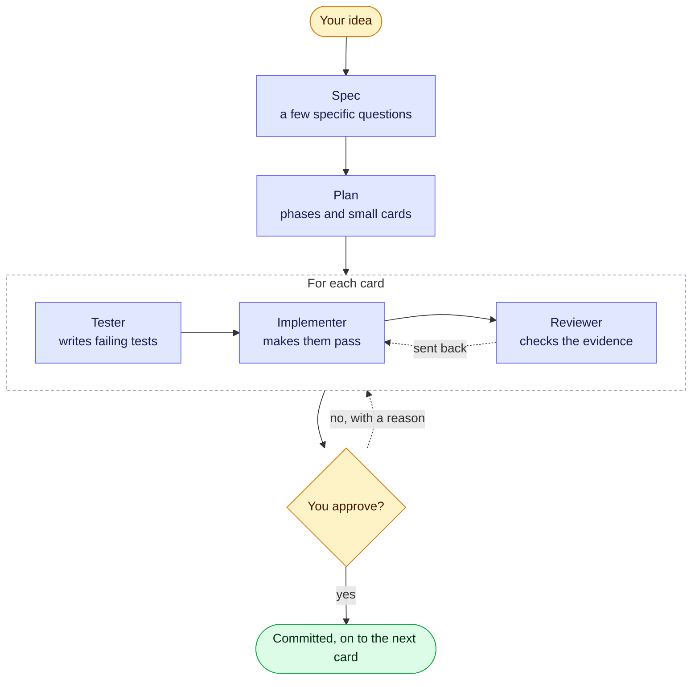

# Groundwork

[](https://github.com/ramesesbarria/groundwork/actions/workflows/ci.yml)
[](https://www.npmjs.com/package/groundwork-ai)
[](https://ramesesbarria.github.io/groundwork/)

**A tool-agnostic workflow for building software with AI agents: spec → plan → test-first build loop → human-approved ship.**

Groundwork gives your AI coding agent a real development process. It interviews you for a spec,
builds the work one small card at a time through separate tester, implementer and reviewer roles,
and stops for your approval before anything is committed. When the agent repeats a mistake, the
mistake becomes a rule — and if the rule keeps being broken, a guard that blocks it.

Groundwork is the **project layer**: it owns the spec, the cards, your approvals, where the project
stands between sessions, and the lessons learned. Task handling stays with your tool and any skill packs.

[**Full documentation →**](https://ramesesbarria.github.io/groundwork/)



## Why Groundwork

- **Evidence, not claims.** Test-first cards, a fresh reviewer, and approval that refuses without proof.
- **You approve.** Every card by default, or each phase — with how to check it yourself.
- **Mistakes become guards.** Note → rule → guard; a lesson climbs only when it repeats.
- **Right-sized.** A typo takes the quick path; a feature gets a spec, a plan and cards.
- **Any tool, any model.** Markdown core, adapters for Claude Code and OpenCode, model per role.
- **Always resumable.** Close the laptop mid-card; the next session picks up from the handoff file.

## Install

```bash
cd your-project
npx groundwork-ai init        # asks: Claude Code, OpenCode, or plain markdown
```

Open your AI tool in the project and type `/gw`. It sets things up the first time; after that it
says where things stand and runs the next step. Nothing is committed until you approve. Update an
existing install with `npx groundwork-ai upgrade` — your spec, cards and lessons are kept.

## Your first session

```text
You:   /gw I want a page where my book club votes on next month's book
Agent: A few specific questions first: who can vote, one vote or rank several, hide results?
You:   Anyone with the link. One vote. Hide results until it closes.
Agent: Spec saved, starting with the smallest useful version. Does it look right? — Yes.
       Plan: 2 phases, 5 cards. OK to write them? — Go.
You:   /gw
Agent: Card 1.1 Book list page: tests written, code passing, review passed.
       What changed: the home page lists this month's books.
       How to check: run npm run dev and open http://localhost:3000
       Caveats: no styling yet. Approve or reject?
You:   /gw-approve
Agent: Committed [1.1] Book list page. Next up: card 1.2 Voting.
```

## Commands

| When you want to… | Type |
|---|---|
| Start, or carry on where you left off | `/gw` |
| Set up Groundwork in this project | `/gw-setup` |
| Turn an idea into a spec | `/gw-spec` |
| Turn the spec into a plan of cards | `/gw-plan` |
| Build the next card | `/gw-next` |
| Accept or send back finished work — only you can | `/gw-approve` · `/gw-reject` |
| Make a small change, fix a bug, or try something out | `/gw-quick` |

Power commands: `/gw-decide`, `/gw-ui-spec`, `/gw-handoff`, `/gw-retro`. In the terminal: `status`, `doctor`, `retro`, `upgrade` (all `npx groundwork-ai`).

## Documentation

- [Installation](https://ramesesbarria.github.io/groundwork/getting-started/installation) · [Your first 10 minutes](https://ramesesbarria.github.io/groundwork/getting-started/first-10-minutes) · [Approval modes](https://ramesesbarria.github.io/groundwork/getting-started/approval-modes)
- [Cards and phases](https://ramesesbarria.github.io/groundwork/concepts/cards-and-phases) · [The build loop](https://ramesesbarria.github.io/groundwork/concepts/the-build-loop) · [Evidence](https://ramesesbarria.github.io/groundwork/concepts/evidence-and-approval) · [Handoff](https://ramesesbarria.github.io/groundwork/concepts/handoff) · [Lessons ledger](https://ramesesbarria.github.io/groundwork/concepts/lessons-ledger)
- [Existing projects](https://ramesesbarria.github.io/groundwork/guides/existing-projects) · [UI and animation](https://ramesesbarria.github.io/groundwork/guides/ui-and-animation) · [Stack decisions](https://ramesesbarria.github.io/groundwork/guides/decisions)
- [Agent commands](https://ramesesbarria.github.io/groundwork/reference/agent-commands) · [CLI](https://ramesesbarria.github.io/groundwork/reference/cli) · [Configuration](https://ramesesbarria.github.io/groundwork/reference/configuration) · [Project files](https://ramesesbarria.github.io/groundwork/reference/project-files) · [Glossary](https://ramesesbarria.github.io/groundwork/glossary) · [Why Groundwork](https://ramesesbarria.github.io/groundwork/why) · [FAQ](https://ramesesbarria.github.io/groundwork/faq)

## Adapters

**Claude Code** gets skills for every command, subagents with limited tools, a guard hook and a
session-start hook that says where things stand. **OpenCode** gets commands, subagents with
permissions and a guard plugin. **Any other tool** reads the plain markdown in `.groundwork/`.

Groundwork is the project layer, so it's designed to work alongside task-level skill packs such as
[superpowers](https://github.com/obra/superpowers).

## License

[MIT](LICENSE)
