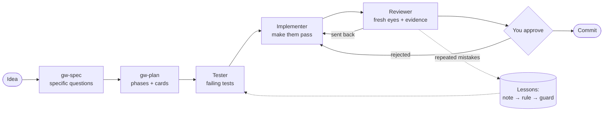

# Groundwork

[](https://github.com/ramesesbarria/groundwork/actions/workflows/ci.yml)

**A tool-agnostic workflow for building software with AI agents: spec → plan → test-first build loop → human-approved ship.**

> **Early preview (v0.3).** Everything below works and is tested, but Groundwork hasn't been proven on a full real project yet. See [Honest limitations](#honest-limitations).

Groundwork is a set of plain-markdown instructions plus a small CLI that you install into a project. It gives your AI coding agent a real development process: it interviews you for a spec, breaks the work into cards, builds each card with separate tester, implementer and reviewer roles, and stops for your approval before anything is committed. When the agent makes the same mistake twice, the mistake becomes a rule. When a rule keeps being broken, it becomes a guard that blocks the action.



## Install

> Groundwork is **not on npm yet**. Until it is, install it from GitHub:

```bash
git clone https://github.com/ramesesbarria/groundwork
cd groundwork && npm install && npm run build

cd path/to/your-project
node path/to/groundwork/cli/dist/bin.js init        # asks: Claude Code, OpenCode, or plain markdown
```

Then open your AI tool in the project and run `/gw-setup`. Without an adapter, ask the agent to read `.groundwork/commands/gw-setup.md` and follow it.

## Why it exists

I built a portfolio, a church website and an event platform with AI agents, and hand-copied a harness into each one, tweaking it every time. The same problems kept coming back: harnesses that grew too heavy to be useful, rules the agent forgot, progress lost at usage limits, UI work that went round in circles, and "done" claims with nothing behind them. Groundwork packages what worked and **enforces** what didn't, instead of hoping the agent remembers.

## How it works

`init` puts everything in one folder and keeps the always-loaded part small (the `AGENTS.md` template is about 400 tokens):

```
AGENTS.md                 short, always loaded; points into .groundwork/
.groundwork/
  SPEC.md                 what we're building
  HANDOFF.md              where things stand; any session, tool or model can resume from it
  LESSONS.md              the lessons ledger
  config.json             approval mode, token budget, guards, commands
  cards/                  one file per unit of work, with acceptance criteria and evidence
  decisions/              stack choices, with the options you chose from
  evidence/               test output and screenshots, linked from cards
  roles/                  planner, tester, implementer, reviewer
  commands/               the gw-* commands, tool-neutral
  guards/                 scripts that block actions
```

- **Four roles, each with a "must not".** The tester can't write the implementation. The implementer can't edit tests. The reviewer can't fix code; it sends the card back. The planner never picks your stack.
- **No evidence, no approval.** A card can't be approved while its Evidence section is empty.
- **You choose how often to approve:** every card (`per-card`, the default) or once per phase (`per-phase`).
- **A light path for small changes.** `gw-quick` skips the card and the roles, but the tests still have to pass.
- **Stack-neutral.** For every stack decision, Groundwork writes 2–4 options with trade-offs and waits for you. "Your call" isn't accepted for those.

## Commands

In your AI tool (as `/gw-…` in Claude Code and OpenCode):

| Command | What it does |
|---|---|
| `gw-setup` | Sets up a new or existing project |
| `gw-spec` | Interviews you for the spec, starting with the smallest useful version |
| `gw-plan` | Records stack decisions, then splits the spec into phases and cards |
| `gw-decide` | Lays out options for one decision and records your choice |
| `gw-ui-spec` | Agrees states, transitions and screen sizes before any UI code |
| `gw-next` | Runs the next ready card: tester → implementer → reviewer |
| `gw-approve` / `gw-reject` | Your verdict on a card (or a whole phase) |
| `gw-quick` | One-pass path for small, low-risk changes |
| `gw-handoff` / `gw-resume` | Save state; continue in a fresh session or another tool |
| `gw-retro` | Proposes moving lessons up the ladder |

In the terminal:

| Command | What it does |
|---|---|
| `groundwork init` | Installs Groundwork (`--adapter claude-code\|opencode\|none`, `--dry-run`). Asks before overwriting; merges into existing settings. |
| `groundwork adapter add <tool>` | Adds or refreshes an adapter |
| `groundwork status` | Phase, cards by status, the next ready card, what's blocked |
| `groundwork doctor` | Token budget, missing guards, drifted adapter files, cards whose status contradicts their history. Exits 1 on problems, so it can run in CI. |
| `groundwork retro` | Collects reverts, quick fixes after a card, rejections and review send-backs for `/gw-retro` |

## The lessons ledger

Every rule records the mistake that created it, and moves up a ladder when the mistake repeats:

**NOTE** (in `LESSONS.md`) → **RULE** (in `AGENTS.md` or a role file, always in context) → **GUARD** (a script that blocks the action)

Real examples from building Groundwork with Groundwork ([LESSONS.md](.groundwork/LESSONS.md)):

- **L-003, "Propose the lean version first"**, was imported as a note, then promoted to a rule when the dogfood run repeated it: a "tiny sample app" spec grew into a multi-user phone app with push notifications.
- **L-015** went straight to a guard. A check once ran `groundwork init` in the wrong folder and installed Groundwork into its own repo. `init` now refuses to run there.
- **L-016** was found by `groundwork status` on its first real run: a card still said `testing` after it had been approved. `doctor` now checks for that.
- **L-017** was found by `groundwork retro`: 3 of the 5 times the reviewer sent work back, one core file contradicted another. Accepted as a note through `/gw-retro`.

The built-in `no-ai-trailers` guard blocks commit messages that add AI attribution. Turn guards on in `.groundwork/config.json`: `"guards": ["no-ai-trailers"]`.

## Adapters

The core is plain markdown, so any agent that can read files can follow it. Adapters add native commands, subagents and guard hooks:

| Tool | What you get | Verified |
|---|---|---|
| **Claude Code** | Skills, subagents with limited tools (the reviewer can't edit files), a `PreToolUse` guard hook, `CLAUDE.md` → `AGENTS.md` | Skills appear in `/gw` autocomplete, and setup, spec and plan ran in a real session ([dogfood](.groundwork/evidence/3.1/dogfood-writeup.md)) |
| **OpenCode** | Commands, subagents with permissions (reviewer `edit: deny`, planner `bash: deny`), a guard plugin | OpenCode 2.0.3 loads the agents with those permissions ([check](.groundwork/evidence/4.3/opencode-check.txt)) |
| **Anything else** | `AGENTS.md` plus the markdown in `.groundwork/` | — |

## Built with itself

Groundwork was built card by card using its own process. The whole trail is public:

- [Cards](.groundwork/cards/): every unit of work, with its acceptance criteria, evidence, reviewer notes and history, including the times the reviewer sent work back.
- [Lessons](.groundwork/LESSONS.md): every rule and where it came from.
- [Dogfood write-up](.groundwork/evidence/3.1/dogfood-writeup.md): what happened when Groundwork was used on a sample app, including what went wrong.
- [Spec](.groundwork/SPEC.md): the design.

## Honest limitations

- **Not yet used end to end on a real project.** Setup, spec and plan have run in a real Claude Code session, and the rest is tested in isolation. A full run on a real app is next ([card 6.1](.groundwork/cards/6.1-real-app-run.md)).
- **Resuming in a different tool hasn't been tested yet**, and neither has whether Claude Code actually runs the role subagents.
- **Guards inside the tools are unconfirmed.** The Claude Code hook relies on `$CLAUDE_PROJECT_DIR` being expanded (not verified on Windows), and the OpenCode plugin is tested in isolation, not inside OpenCode. Guards only see command text, so `git commit -F file` isn't checked.
- **Token counts are estimates** (characters ÷ 4), not a real tokenizer.
- **There's no `upgrade` command.** A project installed with an older version keeps its older `.groundwork/`, and `doctor` can't tell it's behind.
- **Setup for existing projects is untested** on a real codebase.
- **No evals yet.** The planned benchmark comparing tools and models hasn't been run.

## License

[MIT](LICENSE)
