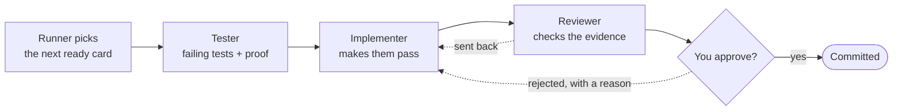

# The build loop

One card goes through three roles, then stops at your door. This is the whole process.

**The runner** is the main session — the one you type `gw-next` into. It hands the card to each
role in turn and never does their work itself.

## The steps

1. **Pick.** The lowest-numbered card whose status is `todo` or `rejected` and whose `depends_on`
   cards are all `done`.
2. **Test.** The tester writes failing tests — one per acceptance criterion — confirms they fail
   *for the right reason*, and saves the failing output as evidence.
3. **Implement.** The implementer makes the tests pass with the smallest reasonable change, then
   runs the full suite, lint and build.
4. **Review.** The reviewer re-runs everything itself, checks every criterion against the diff, and
   fills in the Evidence section — or sends the card back with specific problems.
5. **Approve.** The runner stops and shows you what changed, how to check it yourself, and the
   caveats. (In `per-phase` mode this stop happens at the end of the phase instead.)
6. **Commit.** After approval, the runner commits the card and moves on.

## The roles

| Role | Job | Must not |
|---|---|---|
| **Planner** | Interview you for the spec; write phases, cards and decision records | Write code; choose your stack |
| **Tester** | Turn acceptance criteria into failing tests | Write the implementation; weaken tests later |
| **Implementer** | Make the tests pass with the smallest reasonable change | Edit tests to make them pass; touch unrelated files |
| **Reviewer** | Check the work with fresh eyes, then pass it or send it back | Fix code itself — it sends the card back |

Each role reads only what it needs (its role file, the card, and the files they point to). In tools
with subagents, each role runs as a **separate agent with fresh context**, so the reviewer really
is seeing the work for the first time. The planner never picks a stack: options go to you.

## Statuses

| From | To | Who | When |
|---|---|---|---|
| `todo` | `testing` | runner | Starts the card |
| `testing` | `implementing` | tester | Failing tests are written and saved |
| `implementing` | `review` | implementer | Tests, lint and build all pass |
| `implementing` | `testing` | implementer | A test looks wrong; the reason is written on the card |
| `review` | `implementing` | reviewer | Problems found; listed under History |
| `review` | `awaiting-approval` | reviewer | Passed, in `per-card` mode |
| `review` | `done` | reviewer | Passed, in `per-phase` mode (the runner commits) |
| `awaiting-approval` | `done` | human | Approved (the runner commits) |
| `awaiting-approval` | `rejected` | human | Rejected, with a reason |
| `done` | `rejected` | human | Rejected during a phase review |
| `rejected` | `implementing` | runner | Picked up again; the reason is on the card |

No other changes are allowed, and every change gets one line under History.

After three reviewer send-backs on the same card, the loop stops and asks you rather than going
round again.

## The checks

The project's test, lint and build commands live in `.groundwork/config.json`. Normally **all must
pass** before a card reaches you. On a project with a saved baseline, the rule is **no new
failures** instead. [Evidence and approval →](/concepts/evidence-and-approval#baselines)

## Commits

The runner commits — never a role, never before approval (or before review passes, in `per-phase`
mode). After approval it:

1. marks the card `done` and adds a History line,
2. updates `HANDOFF.md`,
3. commits the card's changes as `[<card-id>] <card title>`,
4. moves to the next card, or stops if you asked it to.

## Without subagents

Any tool that can't start separate agents still works: one session plays every role in turn. Before
each role it reads that role's file and only the files it lists; it finishes the role completely
before switching. As reviewer it re-reads the diff from scratch — and because fresh eyes aren't
really possible, it re-runs every check itself.

## Next

[Evidence and approval →](/concepts/evidence-and-approval)
