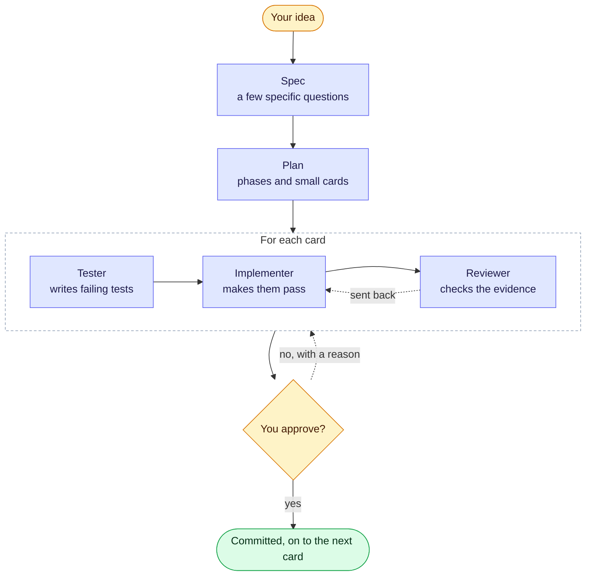

## How it works



## Install

```bash
cd your-project
npx groundwork-ai init
```

Then open your AI tool in the project and type `/gw`. The first time it asks a few setup questions;
after that it always says where things stand and runs the next step.

Nothing is committed until you approve. Every approval tells you how to check the work yourself.

[Your first 10 minutes →](/getting-started/first-10-minutes)
